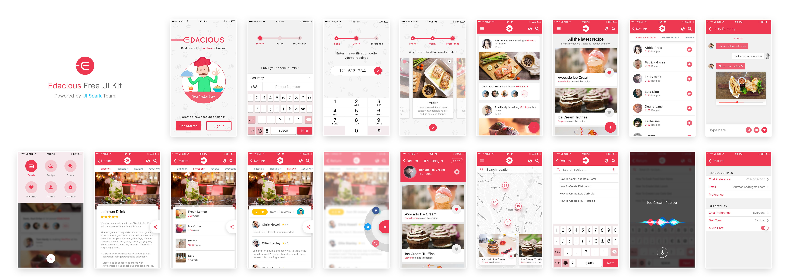

## Edacious-App

## Overview
Edacious app is an open source template PSD template that I converted to ionic angular app.

## Table of contents (pages)

* Project pages 
    - **authentication** page (main page of sign up and login)
    - **Verify** page contains 3 steps 
    - **Home** page 
    - **All-latest-recipes** page
    - **Recipe-details** page 
    - **people** page 
    - **Chat** page 
    - **Settings** page
* Theming and styling
    - PSD template
    - assets folder

**Usage**
it is used as a reference for any ionic developer as it solved these issues
    - element positioning of (relative and obsolute)
    - Which elements to be extracted from PSD
    - Angular routing
    - Chat UI formation
    - Javascript tips and tricks

## How to install

* First intall node js from [here](https://nodejs.org/en/)
* second ionic webiste and follow instruction [here](https://ionicframework.com/docs/intro/cli)

* Third run ionic serve and enjoy :D
